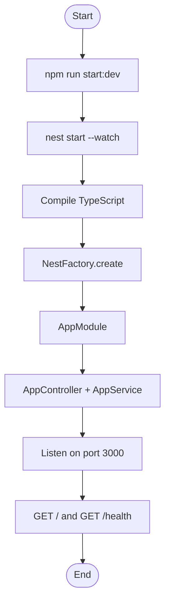
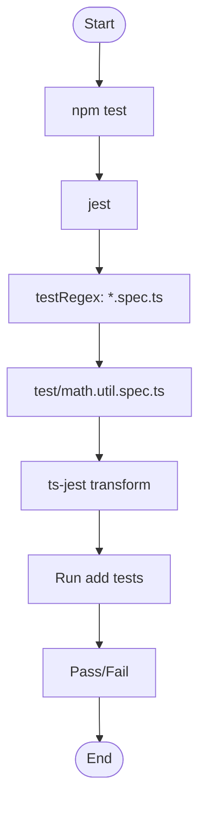

# Test Repo for Introduction to Unit Testing with Jest

A NestJS application that introduces unit testing with Jest. It includes a simple arithmetic utility, a minimal API, and passing tests to demonstrate test setup and execution.

## Overview

This repository provides a minimal NestJS backend with:

- A runnable HTTP server (root and health endpoints)
- A pure utility function that adds two numbers
- Jest unit tests for the utility
- TypeScript throughout with strict typing and documented code

It is intended for learning how to set up Jest in a NestJS project and how to write and run unit tests.

## Features

- **NestJS application**: Bootstrap with `main.ts`, root module, controller, and service
- **HTTP endpoints**: `GET /` returns a welcome message; `GET /health` returns status and ISO 8601 timestamp
- **Math utility**: `add(a, b)` in `src/utils/math.util.ts` for numeric addition
- **Jest tests**: Unit tests in `test/math.util.spec.ts` for the add function (positive, zero, negative, floating-point)
- **ESLint**: Flat config for TypeScript and NestJS
- **Documentation**: Inline documentation in the codebase; HTML documentation can be generated via the configured documentation tool

## Dependencies

### Production

- `@nestjs/common`, `@nestjs/core`, `@nestjs/platform-express`: NestJS framework
- `reflect-metadata`: Required by NestJS for decorators
- `rxjs`: Used by NestJS for reactive patterns

### Development

- `@nestjs/cli`: NestJS CLI for build and dev server (fixed at 11.0.16 for stability)
- `@nestjs/schematics`, `@nestjs/testing`: NestJS tooling and testing utilities
- `typescript`, `ts-node`, `ts-loader`: TypeScript compilation and execution
- `jest`, `ts-jest`: Test runner and TypeScript support for Jest
- `@types/node`, `@types/express`, `@types/jest`: Type definitions
- `eslint`, `@eslint/js`, `@typescript-eslint/*`: Linting
- `prettier`: Code formatting
- `source-map-support`: Better stack traces in Node

### Engine

- Node.js 20 or later (see `engines` in `package.json`)

## Project structure

```text
.
├── src/
│   ├── main.ts              # Application entry, bootstrap
│   ├── app.module.ts        # Root module
│   ├── app.controller.ts    # Root controller (/, /health)
│   ├── app.service.ts       # Root service (getHello, getHealth)
│   └── utils/
│       └── math.util.ts     # add(a, b) utility
├── test/
│   └── math.util.spec.ts    # Unit tests for add()
├── jest.config.ts           # Jest configuration
├── eslint.config.ts         # ESLint flat config
├── tsconfig.json            # TypeScript config (inline source maps, comments kept)
├── tsconfig.build.json      # Build config (excludes test files)
├── nest-cli.json            # NestJS CLI config
├── Doxyfile                 # Doxygen configuration
└── package.json             # Scripts and dependencies
```

## Code change summary

- **Initial setup**: Added `package.json` with NestJS 11, Jest, TypeScript, and ESLint; Node engine set to >=20.
- **TypeScript**: Added `tsconfig.json` and `tsconfig.build.json` with `inlineSourceMap`, `inlineSources`, `sourceMap: false`, `removeComments: false` as specified.
- **NestJS**: Implemented `src/main.ts`, `AppModule`, `AppController`, and `AppService` so the app starts and serves `/` and `/health`.
- **Utility**: Implemented `src/utils/math.util.ts` with a single exported function `add(a, b)` returning the sum of two numbers.
- **Tests**: Added `test/math.util.spec.ts` with four test cases for `add` (positive integers, zero, negatives, floating-point).
- **Jest**: Added `jest.config.ts` with Node environment, ts-jest transform, and test pattern for `*.spec.ts` (and related).
- **ESLint**: Added `eslint.config.ts` (flat config) for TypeScript and Jest globals.
- **Nest CLI**: Added `nest-cli.json` with source root `src` and default compiler options.

## Flow: application startup



## Flow: running tests



## How to run the application

1. Install dependencies: `npm install`
2. Start the dev server: `npm run start:dev`
3. The server listens on port 3000 (or `PORT` if set). Open `http://localhost:3000/` for the welcome message and `http://localhost:3000/health` for the health payload.

## How to test and debug

### Run all tests

- `npm test`
  Runs Jest once and reports results for all `*.spec.ts` files (e.g. `test/math.util.spec.ts`).

### Watch mode

- `npm run test:watch`
  Jest watches files and re-runs tests on changes. Useful while editing code or tests.

### Coverage

- `npm run test:cov`
  Runs Jest with coverage and writes a report under `./coverage`.

### Linting

- `npm run lint`
  Runs ESLint on `src`, `apps`, `libs`, and `test` with auto-fix where applicable. Fix any reported errors before committing.

### Install, audit, and lint

To run the three steps until they have no blocking issues:

1. `npm install`
   Installs dependencies. Deprecation warnings for transitive packages (e.g. old `glob`/`inflight`) are addressed by overrides in `package.json`.

2. `npm run audit:fix`
   Runs `npm audit fix` (to apply any safe fixes), then `npm audit --audit-level=high` so the command exits successfully when only moderate or lower advisories remain. High and critical vulnerabilities cause a non-zero exit.

3. `npm run lint`
   Runs ESLint as above.

### Debugging the application

- `npm run start:debug`
  Starts the NestJS app in debug mode with watch. Attach your IDE debugger to the Node process (default port often 9229) to set breakpoints in `src/main.ts`, controllers, or services.

### Build for production

- `npm run build`
  Compiles TypeScript to `dist/` using `tsconfig.build.json`. Run the app with `npm run start:prod` (build then `node dist/src/main`).

## Testing strategy

- **Unit tests**: The only tests in this repo are unit tests for the `add` utility. They run in isolation with no HTTP server or database.
- **What is tested**: Correctness of `add` for positive integers, zero, negative integers, and floating-point numbers (using `toBeCloseTo` for floats).
- **What is not tested**: The NestJS HTTP layer (e.g. AppController, AppService) is not covered by tests in this introduction; it can be added in a follow-up.

## Troubleshooting

- **Port in use**: If port 3000 is already in use, set `PORT` (e.g. `PORT=3001 npm run start:dev`) or change the default in code.
- **Tests not found**: Ensure test files match the pattern in `jest.config.ts` (`.*\\.spec\\.(t|j)sx?$`) and are under the project root (e.g. under `test/`).
- **TypeScript errors**: Run `npm run build` to see compilation errors; ensure `tsconfig.json` and `tsconfig.build.json` are unchanged if the build previously succeeded.
- **Lint errors**: Run `npm run lint` and fix reported issues; the config uses TypeScript-aware rules, so type errors may appear as lint errors.

